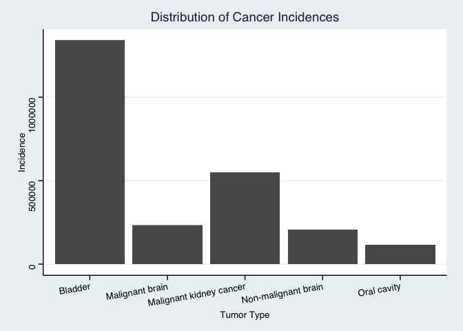
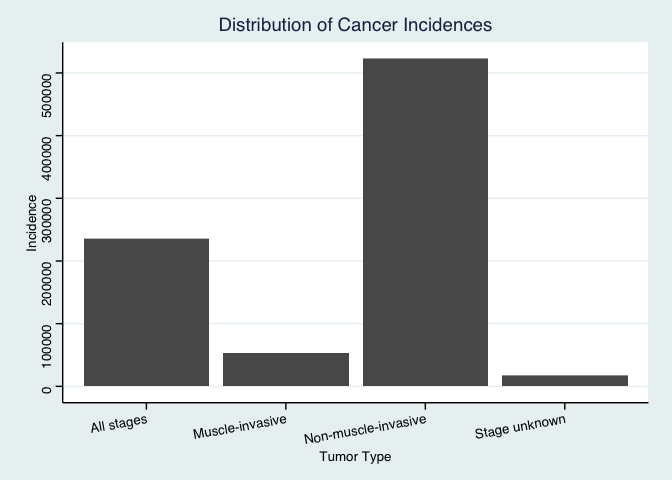
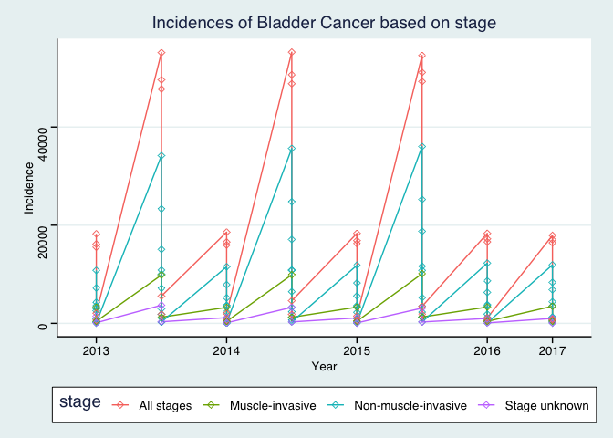
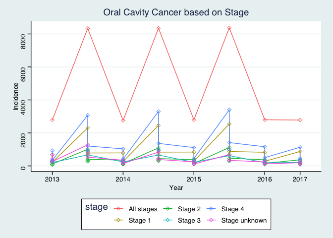

## Instructions
Answer the following questions and complete the exercises in RMarkdown. Please embed all of your code and push your final work to your repository. Your code should be organized, clean, and run free from errors. Be sure to **add your name** to the author header above. You may use any resources to answer these questions (including each other), but you may not post questions to Open Stacks or external help sites. There are 10 total questions.  

Make sure to use the formatting conventions of RMarkdown to make your report neat and clean! Your plots should use consistent aesthetics throughout. Feel free to be creative- there are many possible solutions to these questions!  

This exam is due by **12:00p on Tuesday, February 23**.  

## Load the libraries

```r
library(tidyverse)
```

```
## ── Attaching packages ────────────────────────────────────────────────────────────────────────────────────────────────────────────────────────── tidyverse 1.3.0 ──
```

```
## ✔ ggplot2 3.2.1     ✔ purrr   0.3.3
## ✔ tibble  3.0.4     ✔ dplyr   1.0.2
## ✔ tidyr   1.1.2     ✔ stringr 1.4.0
## ✔ readr   1.3.1     ✔ forcats 0.5.0
```

```
## Warning: package 'tibble' was built under R version 3.6.2
```

```
## Warning: package 'tidyr' was built under R version 3.6.2
```

```
## Warning: package 'dplyr' was built under R version 3.6.2
```

```
## ── Conflicts ───────────────────────────────────────────────────────────────────────────────────────────────────────────────────────────── tidyverse_conflicts() ──
## ✖ dplyr::filter() masks stats::filter()
## ✖ dplyr::lag()    masks stats::lag()
```

```r
library(janitor)
```

```
## Warning: package 'janitor' was built under R version 3.6.2
```

```
## 
## Attaching package: 'janitor'
```

```
## The following objects are masked from 'package:stats':
## 
##     chisq.test, fisher.test
```

```r
library(here)
```

```
## Warning: package 'here' was built under R version 3.6.2
```

```
## here() starts at /Users/AnthonyWeidner/Desktop/BIS15W2021_aweidner
```

```r
options(scipen=999) #disables scientific notation when printing
library(ggthemes)
```

```
## Warning: package 'ggthemes' was built under R version 3.6.2
```

## Gapminder
For this assignment, we are going to use data from  [gapminder](https://www.gapminder.org/). Gapminder includes information about economics, population, social issues, and life expectancy from countries all over the world. We will use three data sets, so please load all three.  

One thing to note is that the data include years beyond 2021. These are projections based on modeling done by the gapminder organization. Start by importing the data.

```r
cancer_general_data <- readr::read_csv("data/GDO_data_wide.csv")
```

```
## Parsed with column specification:
## cols(
##   .default = col_character(),
##   Incidence = col_double(),
##   Population = col_double(),
##   `Incidence Rate` = col_double(),
##   `Incidence Rate LCI (95%)` = col_double(),
##   `Incidence Rate UCI (95%)` = col_double()
## )
```

```
## See spec(...) for full column specifications.
```

```r
cancer_general_data <- janitor::clean_names(cancer_general_data)
cancer_general_data
```

```
## # A tibble: 4,744 x 161
##    cancer_site year  tumour_type tumour_type_2 tumour_type_3 basis_of_diagno…
##    <chr>       <chr> <chr>       <chr>         <chr>         <chr>           
##  1 Bladder, U… 2013  All         All           All           Not split by Ba…
##  2 Bladder, U… 2013  Renal Pelv… All           All           Not split by Ba…
##  3 Bladder, U… 2013  Renal Pelv… Malignant an… All           Not split by Ba…
##  4 Bladder, U… 2013  Renal Pelv… Malignant an… All           Not split by Ba…
##  5 Bladder, U… 2013  Renal Pelv… Malignant an… All           Not split by Ba…
##  6 Bladder, U… 2013  Renal Pelv… Malignant an… All           Not split by Ba…
##  7 Bladder, U… 2013  Renal Pelv… Malignant an… All           Not split by Ba…
##  8 Bladder, U… 2013  Renal Pelv… Malignant an… All           Not split by Ba…
##  9 Bladder, U… 2013  Renal Pelv… Malignant an… All           Not split by Ba…
## 10 Bladder, U… 2013  Renal Pelv… Malignant an… All           Not split by Ba…
## # … with 4,734 more rows, and 155 more variables: stage <chr>,
## #   stage_detail <chr>, stage_detail_2 <chr>, age <chr>, region <chr>,
## #   sex <chr>, grade <chr>, nodal_status <chr>, incidence <dbl>,
## #   population <dbl>, incidence_rate <dbl>,
## #   incidence_rate_lci_95_percent <dbl>, incidence_rate_uci_95_percent <dbl>,
## #   ct_count <chr>, ct_cohort <chr>, ct_percentage <chr>,
## #   ct_percentage_lci_95_percent <chr>, ct_percentage_uci_95_percent <chr>,
## #   rt_count <chr>, rt_cohort <chr>, rt_percentage <chr>,
## #   rt_percentage_lci_95_percent <chr>, rt_percentage_uci_95_percent <chr>,
## #   surgery_count <chr>, surgery_cohort <chr>, surgery_percentage <chr>,
## #   surgery_percentage_lci_95_percent <chr>,
## #   surgery_percentage_uci_95_percent <chr>, ct_only_count <chr>,
## #   ct_only_cohort <chr>, ct_only_percentage <chr>,
## #   ct_only_percentage_lci_95_percent <chr>,
## #   ct_only_percentage_uci_95_percent <chr>, rt_only_count <chr>,
## #   rt_only_cohort <chr>, rt_only_percentage <chr>,
## #   rt_only_percentage_lci_95_percent <chr>,
## #   rt_only_percentage_uci_95_percent <chr>, surgery_only_count <chr>,
## #   surgery_only_cohort <chr>, surgery_only_percentage <chr>,
## #   surgery_only_percentage_lci_95_percent <chr>,
## #   surgery_only_percentage_uci_95_percent <chr>, ct_and_rt_count <chr>,
## #   ct_and_rt_cohort <chr>, ct_and_rt_percentage <chr>,
## #   ct_and_rt_percentage_lci_95_percent <chr>,
## #   ct_and_rt_percentage_uci_95_percent <chr>, surgery_and_ct_count <chr>,
## #   surgery_and_ct_cohort <chr>, surgery_and_ct_percentage <chr>,
## #   surgery_and_ct_percentage_lci_95_percent <chr>,
## #   surgery_and_ct_percentage_uci_95_percent <chr>, surgery_and_rt_count <chr>,
## #   surgery_and_rt_cohort <chr>, surgery_and_rt_percentage <chr>,
## #   surgery_and_rt_percentage_lci_95_percent <chr>,
## #   surgery_and_rt_percentage_uci_95_percent <chr>,
## #   surgery_and_ct_and_rt_count <chr>, surgery_and_ct_and_rt_cohort <chr>,
## #   surgery_and_ct_and_rt_percentage <chr>,
## #   surgery_and_ct_and_rt_percentage_lci_95_percent <chr>,
## #   surgery_and_ct_and_rt_percentage_uci_95_percent <chr>,
## #   other_care_count <chr>, other_care_cohort <chr>,
## #   other_care_percentage <chr>, other_care_percentage_lci_95_percent <chr>,
## #   other_care_percentage_uci_95_percent <chr>, initial_cohort_size <chr>,
## #   survival_cohort_size <chr>, net_survival_03m <chr>,
## #   net_survival_03m_lci <chr>, net_survival_03m_uci <chr>,
## #   crude_survival_03m <chr>, crude_survival_03m_lci <chr>,
## #   crude_survival_03m_uci <chr>, net_survival_06m <chr>,
## #   net_survival_06m_lci <chr>, net_survival_06m_uci <chr>,
## #   crude_survival_06m <chr>, crude_survival_06m_lci <chr>,
## #   crude_survival_06m_uci <chr>, net_survival_09m <chr>,
## #   net_survival_09m_lci <chr>, net_survival_09m_uci <chr>,
## #   crude_survival_09m <chr>, crude_survival_09m_lci <chr>,
## #   crude_survival_09m_uci <chr>, net_survival_12m <chr>,
## #   net_survival_12m_lci <chr>, net_survival_12m_uci <chr>,
## #   crude_survival_12m <chr>, crude_survival_12m_lci <chr>,
## #   crude_survival_12m_uci <chr>, net_survival_24m <chr>,
## #   net_survival_24m_lci <chr>, net_survival_24m_uci <chr>,
## #   crude_survival_24m <chr>, crude_survival_24m_lci <chr>,
## #   crude_survival_24m_uci <chr>, …
```


```r
cancer_general_data %>%
  group_by(tumour_type) %>%
  filter(grepl('Bladder|brain|Oral cavity|kidney',tumour_type)) %>%
  ggplot(aes(x = tumour_type, y=incidence)) +
  labs(title = "Distribution of Cancer Incidences",
       x = "Tumor Type",
       y = "Incidence")+ theme_stata()+
  theme(axis.text.x = element_text(angle = 10, hjust = 1))+
  geom_col()
```

<!-- -->


```r
cancer_specific <- cancer_general_data %>%
  filter(tumour_type=="Bladder" & tumour_type_2!="All" & tumour_type_3!="All") %>%
  group_by(stage) %>%
  summarize(tumour_type, tumour_type_2, tumour_type_3, stage, incidence, incidence_rate) %>%
  arrange(desc(incidence_rate))
```

```
## `summarise()` regrouping output by 'stage' (override with `.groups` argument)
```

```r
cancer_specific
```

```
## # A tibble: 136 x 6
## # Groups:   stage [4]
##    stage      tumour_type tumour_type_2   tumour_type_3 incidence incidence_rate
##    <chr>      <chr>       <chr>           <chr>             <dbl>          <dbl>
##  1 All stages Bladder     Malignant and … Urothelial        16609           30.1
##  2 All stages Bladder     Malignant and … Urothelial        49280           29.7
##  3 All stages Bladder     Malignant and … Urothelial        48824           29.7
##  4 All stages Bladder     Malignant and … Urothelial        16250           29.7
##  5 All stages Bladder     Malignant and … Urothelial        16421           29.5
##  6 All stages Bladder     Malignant and … Urothelial        15965           29.4
##  7 All stages Bladder     Malignant and … Urothelial        47751           29.3
##  8 All stages Bladder     Malignant and … Urothelial        15536           28.8
##  9 Non-muscl… Bladder     Malignant and … Urothelial        12276           22.2
## 10 Non-muscl… Bladder     Malignant and … Urothelial        36038           21.8
## # … with 126 more rows
```


```r
cancer_specific %>%
  group_by(stage) %>%
  ggplot(aes(x = stage, y=incidence)) +
  labs(title = "Distribution of Cancer Incidences",
       x = "Tumor Type",
       y = "Incidence")+ theme_stata()+
  theme(axis.text.x = element_text(angle = 10, hjust = 1))+
  geom_col()
```

<!-- -->


```r
cancer_general_data %>%
  filter(tumour_type=="Bladder") %>%
  ggplot(aes(x=year,y=incidence,group=stage, color = stage))+
  geom_line()+
  geom_point(shape=5)+
  scale_x_discrete(breaks=c(2013,2014,2015,2016,2017,2017))+
  labs(title = "Incidences of Bladder Cancer based on stage",
       x = "Year",y="Incidence") + theme_stata()
```

<!-- -->


```r
cancer_general_data %>%
  filter(tumour_type=="Oral cavity") %>%
  ggplot(aes(x=year,y=incidence,group=stage, color = stage))+
  geom_line()+
  geom_point(shape=5)+
  scale_x_discrete(breaks=c(2013,2014,2015,2016,2017,2017))+
  labs(title = "Oral Cavity Cancer based on Stage",
       x = "Year",y="Incidence") + theme_stata()
```

<!-- -->


```r
cancer_general_data %>%
  filter(tumour_type=="Malignant kidney cancer") %>%
  ggplot(aes(x=year,y=incidence,group=stage, color = stage))+
  geom_line()+
  geom_point(shape=5)+
  scale_x_discrete(breaks=c(2013,2014,2015,2016,2017,2017))+
  labs(title = "Malignant Kidney Cancer Distribution",
       x = "Year",y="Incidence") + theme_stata()
```

<!-- -->

