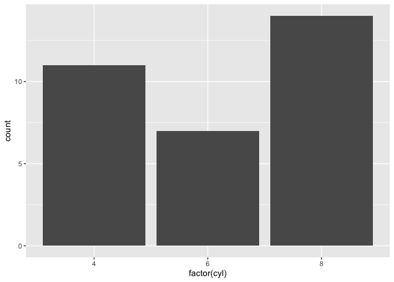

## R Markdown
### Test
# Test1

```r
4*2
```

```
## [1] 8
```

```r
5-3*7
```

```
## [1] -16
```


```r
#install.packages("tidyverse")
library("tidyverse")
```


```r
ggplot(mtcars, aes(x = factor(cyl))) +
    geom_bar()
```

<!-- -->

