## Instructions
Answer the following questions and complete the exercises in RMarkdown. Please embed all of your code and push your final work to your repository. Your final lab report should be organized, clean, and run free from errors. Remember, you must remove the `#` for the included code chunks to run. Be sure to add your name to the author header above. For any included plots, make sure they are clearly labeled. You are free to use any plot type that you feel best communicates the results of your analysis.  

**In this homework, you should make use of the aesthetics you have learned. It's OK to be flashy!**

Make sure to use the formatting conventions of RMarkdown to make your report neat and clean!  

## Load the libraries

```r
library(tidyverse)
library(janitor)
library(here)
library(naniar)
library(ggthemes)
```

## Resources
The idea for this assignment came from [Rebecca Barter's](http://www.rebeccabarter.com/blog/2017-11-17-ggplot2_tutorial/) ggplot tutorial so if you get stuck this is a good place to have a look.  

## Gapminder
For this assignment, we are going to use the dataset [gapminder](https://cran.r-project.org/web/packages/gapminder/index.html). Gapminder includes information about economics, population, and life expectancy from countries all over the world. You will need to install it before use. This is the same data that we will use for midterm 2 so this is good practice.

```r
#install.packages("gapminder")
library("gapminder")
```

## Questions
The questions below are open-ended and have many possible solutions. Your approach should, where appropriate, include numerical summaries and visuals. Be creative; assume you are building an analysis that you would ultimately present to an audience of stakeholders. Feel free to try out different `geoms` if they more clearly present your results.  

**1. Use the function(s) of your choice to get an idea of the overall structure of the data frame, including its dimensions, column names, variable classes, etc. As part of this, determine how NA's are treated in the data.**  


```r
glimpse(gapminder)
```

```
## Rows: 1,704
## Columns: 6
## $ country   <fct> Afghanistan, Afghanistan, Afghanistan, Afghanistan, Afghani…
## $ continent <fct> Asia, Asia, Asia, Asia, Asia, Asia, Asia, Asia, Asia, Asia,…
## $ year      <int> 1952, 1957, 1962, 1967, 1972, 1977, 1982, 1987, 1992, 1997,…
## $ lifeExp   <dbl> 28.801, 30.332, 31.997, 34.020, 36.088, 38.438, 39.854, 40.…
## $ pop       <int> 8425333, 9240934, 10267083, 11537966, 13079460, 14880372, 1…
## $ gdpPercap <dbl> 779.4453, 820.8530, 853.1007, 836.1971, 739.9811, 786.1134,…
```

```r
str(gapminder)
```

```
## tibble [1,704 × 6] (S3: tbl_df/tbl/data.frame)
##  $ country  : Factor w/ 142 levels "Afghanistan",..: 1 1 1 1 1 1 1 1 1 1 ...
##  $ continent: Factor w/ 5 levels "Africa","Americas",..: 3 3 3 3 3 3 3 3 3 3 ...
##  $ year     : int [1:1704] 1952 1957 1962 1967 1972 1977 1982 1987 1992 1997 ...
##  $ lifeExp  : num [1:1704] 28.8 30.3 32 34 36.1 ...
##  $ pop      : int [1:1704] 8425333 9240934 10267083 11537966 13079460 14880372 12881816 13867957 16317921 22227415 ...
##  $ gdpPercap: num [1:1704] 779 821 853 836 740 ...
```

```r
summary(gapminder)
```

```
##         country        continent        year         lifeExp     
##  Afghanistan:  12   Africa  :624   Min.   :1952   Min.   :23.60  
##  Albania    :  12   Americas:300   1st Qu.:1966   1st Qu.:48.20  
##  Algeria    :  12   Asia    :396   Median :1980   Median :60.71  
##  Angola     :  12   Europe  :360   Mean   :1980   Mean   :59.47  
##  Argentina  :  12   Oceania : 24   3rd Qu.:1993   3rd Qu.:70.85  
##  Australia  :  12                  Max.   :2007   Max.   :82.60  
##  (Other)    :1632                                                
##       pop              gdpPercap       
##  Min.   :6.001e+04   Min.   :   241.2  
##  1st Qu.:2.794e+06   1st Qu.:  1202.1  
##  Median :7.024e+06   Median :  3531.8  
##  Mean   :2.960e+07   Mean   :  7215.3  
##  3rd Qu.:1.959e+07   3rd Qu.:  9325.5  
##  Max.   :1.319e+09   Max.   :113523.1  
## 
```

```r
anyNA(gapminder)
```

```
## [1] FALSE
```


**2. Among the interesting variables in gapminder is life expectancy. How has global life expectancy changed between 1952 and 2007?**


```r
gapminder_summary <- gapminder %>%
  group_by(year) %>%
  summarize(mean_lifeExp = mean(lifeExp))
```

```
## `summarise()` ungrouping output (override with `.groups` argument)
```

```r
gapminder_summary
```

```
## # A tibble: 12 x 2
##     year mean_lifeExp
##    <int>        <dbl>
##  1  1952         49.1
##  2  1957         51.5
##  3  1962         53.6
##  4  1967         55.7
##  5  1972         57.6
##  6  1977         59.6
##  7  1982         61.5
##  8  1987         63.2
##  9  1992         64.2
## 10  1997         65.0
## 11  2002         65.7
## 12  2007         67.0
```


```r
p <- gapminder_summary %>%
  ggplot(aes(x = year, y=mean_lifeExp, fill=year)) +
  labs(title = "Average Life Expectancy over the years",
       x = "Year",
       y = "Mean Life Expectancy")+
  geom_col()+
  theme(plot.title = element_text(size = rel(0.95), hjust = 0.5)) 

p
```

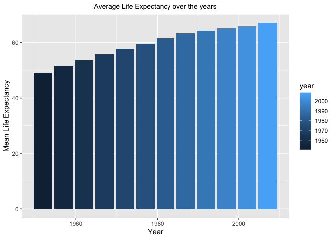<!-- -->


**3. How do the distributions of life expectancy compare for the years 1952 and 2007?**


```r
gapminder$year<-as.factor(gapminder$year)
```


```r
gapminder%>%
  filter(year == 1952 | year == 2007)%>%
  ggplot(aes(x=year,y=lifeExp))+
  geom_boxplot()+
  theme(axis.text.x = element_text(angle = 60, hjust = 1))+
  labs(title = "Life Expectancy Distribution in 1952 and 2007",
       x = "Year",y="Life Expectancy")
```

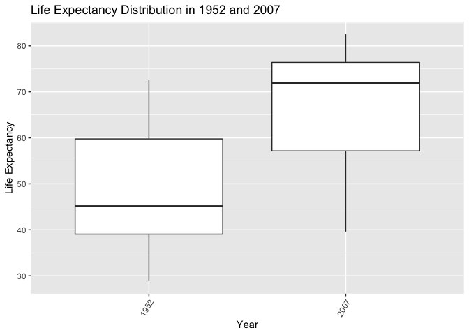<!-- -->


**4. Your answer above doesn't tell the whole story since life expectancy varies by region. Make a summary that shows the min, mean, and max life expectancy by continent for all years represented in the data.**


```r
gapminder_summary <- gapminder%>%
  group_by(year,continent)%>%
  summarise(mean_lifeExp=mean(lifeExp),
            max_lifeExp=max(lifeExp),
            min_lifeExp=min(lifeExp))
```

```
## `summarise()` regrouping output by 'year' (override with `.groups` argument)
```

```r
gapminder_summary
```

```
## # A tibble: 60 x 5
## # Groups:   year [12]
##    year  continent mean_lifeExp max_lifeExp min_lifeExp
##    <fct> <fct>            <dbl>       <dbl>       <dbl>
##  1 1952  Africa            39.1        52.7        30  
##  2 1952  Americas          53.3        68.8        37.6
##  3 1952  Asia              46.3        65.4        28.8
##  4 1952  Europe            64.4        72.7        43.6
##  5 1952  Oceania           69.3        69.4        69.1
##  6 1957  Africa            41.3        58.1        31.6
##  7 1957  Americas          56.0        70.0        40.7
##  8 1957  Asia              49.3        67.8        30.3
##  9 1957  Europe            66.7        73.5        48.1
## 10 1957  Oceania           70.3        70.3        70.3
## # … with 50 more rows
```


```r
gapminder%>%
  ggplot(aes(x=year,y=lifeExp, fill = continent))+
  geom_boxplot()+
  theme(axis.text.x = element_text(angle = 60, hjust = 1))+
  labs(title = "Life Expectancy Distribution over the Years",
       x = "Year",y="Life Expectancy") + theme_stata()
```

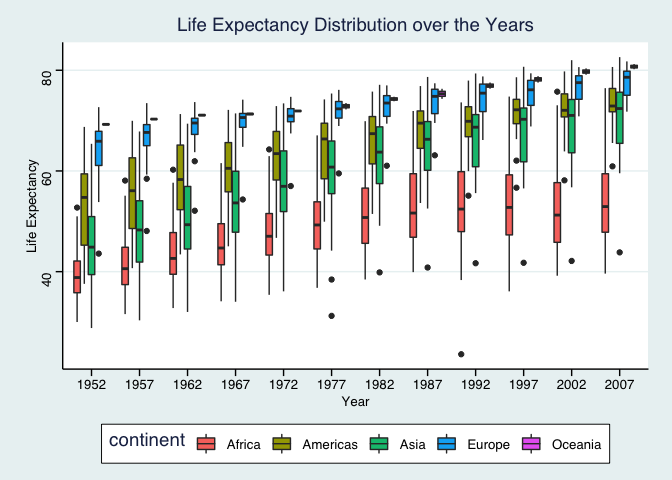<!-- -->


```r
gapminder_summary%>%
  ggplot(aes(x=year,y=mean_lifeExp, color = continent))+
  geom_point()+
  theme(axis.text.x = element_text(angle = 60, hjust = 1))+
  labs(title = "Mean Life Expectancy over the Years",
       x = "Year",y="Mean Life Expectancy") + theme_stata()
```

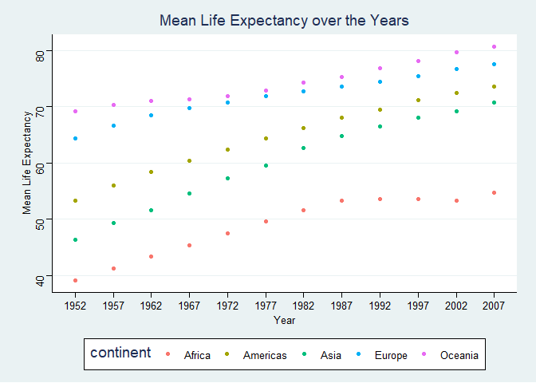<!-- -->


```r
gapminder_summary%>%
  ggplot(aes(x=year,y=min_lifeExp, color = continent))+
  geom_point(shape=3)+
  theme(axis.text.x = element_text(angle = 60, hjust = 1))+
  labs(title = "Minimum Life Expectancy over the Years",
       x = "Year",y="Minimum Life Expectancy") + theme_stata()
```

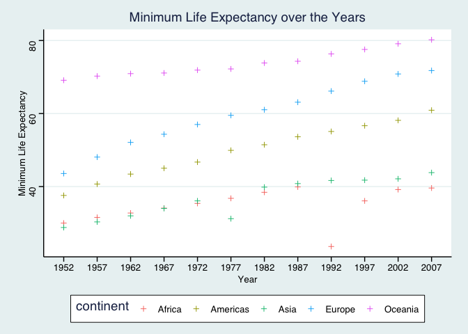<!-- -->


```r
gapminder_summary%>%
  ggplot(aes(x=year,y=max_lifeExp, color = continent))+
  geom_point(shape=6)+
  theme(axis.text.x = element_text(angle = 60, hjust = 1))+
  labs(title = "Maximum Life Expectancy over the Years",
       x = "Year",y="Maximum Life Expectancy") + theme_stata()
```

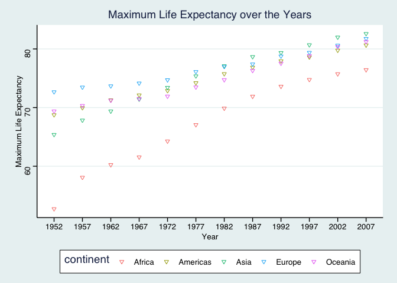<!-- -->

**5. How has life expectancy changed between 1952-2007 for each continent?**


```r
gapminder_summary$year<-as.factor(gapminder_summary$year)
```


```r
gapminder_summary%>%
  ggplot(aes(x=year,y=mean_lifeExp, group=continent, color = continent))+
  geom_line()+
  geom_point()+
  theme(axis.text.x = element_text(angle = 60, hjust = 1))+
  labs(title = "Mean Life Expectancy over the Years",
       x = "Year",y="Mean Life Expectancy") + theme_stata()
```

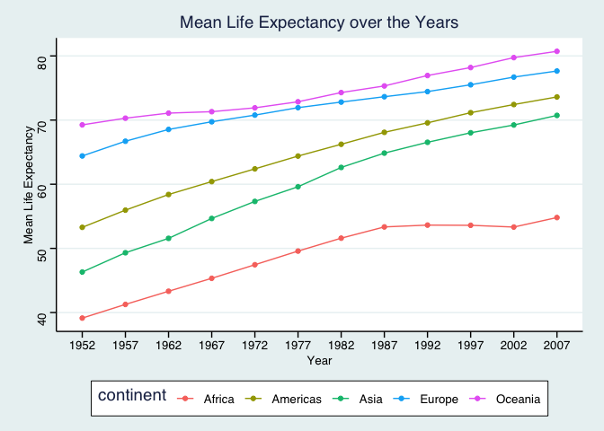<!-- -->


**6. We are interested in the relationship between per capita GDP and life expectancy; i.e. does having more money help you live longer?**


```r
gapminder%>%
  ggplot(aes(x=log10(gdpPercap),y=lifeExp,color=continent))+
  geom_point()+
  theme(axis.text.x = element_text(angle = 60, hjust = 1))+
  labs(title = "Log10 Per Capita GDP vs Life Expectancy",
       x = "Log10 Per Capita GDP",y="Life Expectancy") + theme_stata()
```

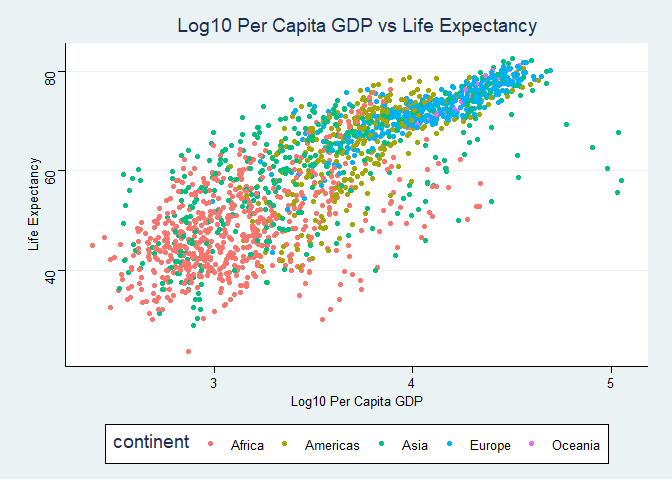<!-- -->

Yes, according to the scatterplot above, having more money (higher per capita GDP) seems to result in longer life expectancies. 

**7. Which countries have had the largest population growth since 1952?**


```r
gapminder_summary <- gapminder %>%
  filter(year==1952 | year == 2007) %>%
  group_by(country) %>%
  summarize(country, pop_diff = pop - lag(pop, default=first(pop))) 
```

```
## `summarise()` regrouping output by 'country' (override with `.groups` argument)
```

```r
gapminder_summary %>%
  arrange(desc(pop_diff))
```

```
## # A tibble: 284 x 2
## # Groups:   country [142]
##    country        pop_diff
##    <fct>             <int>
##  1 China         762419569
##  2 India         738396331
##  3 United States 143586947
##  4 Indonesia     141495000
##  5 Brazil        133408087
##  6 Pakistan      127924057
##  7 Bangladesh    103561480
##  8 Nigeria       101912068
##  9 Mexico         78556574
## 10 Philippines    68638596
## # … with 274 more rows
```

China, India, the United States, Indonesia, and Brazil have had the largest population growth since 1952. 

**8. Use your results from the question above to plot population growth for the top five countries since 1952.**


```r
gapminder_summary %>%
  filter(pop_diff>133000000) %>%
  ggplot(aes(x=country, y=pop_diff,fill=country)) + geom_col() + theme_stata() +
  labs(title = "Population Growth for Top 5 Countries since 1952",
       x = "Country",y="Population Growth")
```

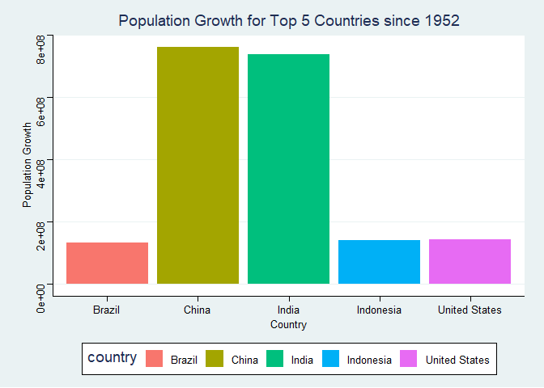<!-- -->


**9. How does per-capita GDP growth compare between these same five countries?**


```r
gapminder %>%
  filter(country == "Brazil" | country == "China" | country == "India" | country == "Indonesia" | country == "United States") %>%
  ggplot(aes(x=year, y=gdpPercap, group=country, color=country, shape = country)) + geom_point() + geom_line() + theme_stata() +
  labs(title = "Per Capita GDP growth",
       x = "Country",y="Per Capita GDP Growth")
```

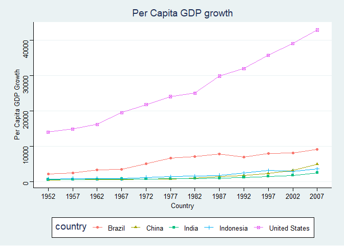<!-- -->


**10. Make one plot of your choice that uses faceting!**


```r
gapminder_plot1 <- gapminder%>%
  ggplot(aes(x=gdpPercap))+
  geom_density()
```


```r
gapminder_plot1+facet_wrap(~continent)+theme_stata()+
  theme(axis.text.x = element_text(angle = 60, hjust = 1))+
  labs(title = "Density Distribution of GDP Per Cap")
```

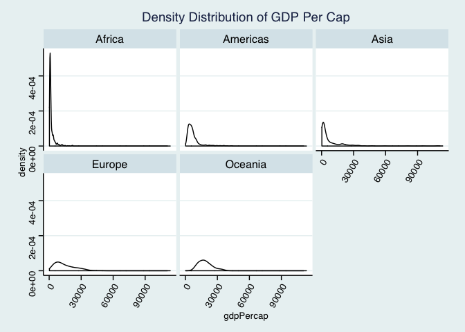<!-- -->


## Push your final code to GitHub!
Please be sure that you check the `keep md` file in the knit preferences. 
